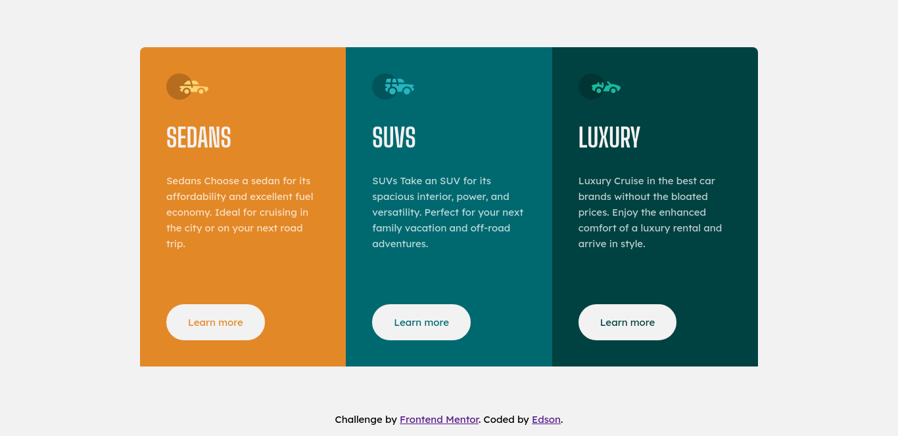

<h1 style="text-align: center">
    ✨ Frontend Mentor - 3-column preview card component solution ✨
</h1>

<h1>
    
</h1>

### 🧾 Sobre

Essa é uma solução para [3-column preview card component challenge on Frontend Mentor](https://www.frontendmentor.io/challenges/3column-preview-card-component-pH92eAR2-). Os desafios do Frontend Mentor ajudam você a melhorar suas habilidades de codificação criando projetos realistas.

---

### 🚀 Tecnologias utilizadas

-   Html
-   Css
-   Padronização BEM
-   Flexbox

---

### 📖 O que eu aprendi

Durante o desenvolvimento do desafio, eu aprendi como o flexbox funciona.

```css
.elemento-pai {
    display: flex;
}

.elemento-filho {
    flex: 1 1 30rem;
}
```

---

### 👨‍💻 Desenvolvimento contínuo

Pretendo utilizar códigos padronizados à BEM, pois facilita a leitura do código HTML e CSS. Além disso, evita que aconteça conflitos de estilos.

---

### 🤝 Recursos úteis

-   [BEM](https://en.bem.info/methodology/quick-start/) - Isso me ajudou a deixar o CSS fácil de ler. Gostei muito deste modelo e vou usá-lo daqui para frente.
-   [Flexbox](https://origamid.com/projetos/flexbox-guia-completo/) - Este é um site incrível que me ajudou a finalmente entender Flexbox. Eu recomendo para quem ainda está aprendendo este conceito.

---

### 〽️ Getting started

```zsh
    # Clonando o repositório em sua máquina
    $ git clone https://github.com/edsonjaguiar/Solution-FrontendMentor
```
